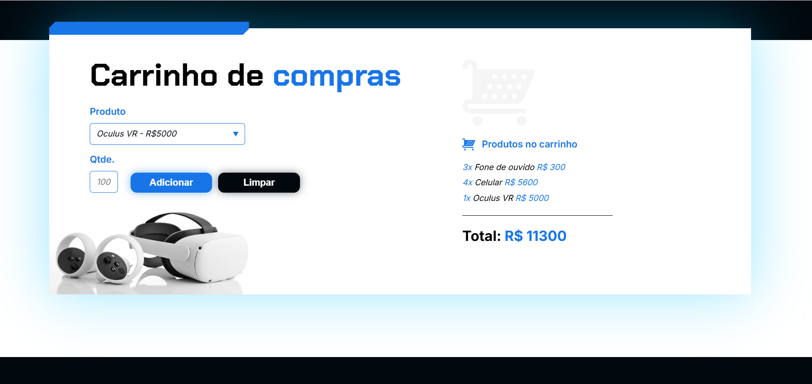

# Shop Alura

Projeto realizado durante o Curso de Lógica de programação: praticando com desafios

### Sobre o projeto

Você podera comprar itens de tecnologia no e-commerce Alura Shops

### Tecnologias utilizadas 

## Quer jogar ?

Acesse o [Shop Alura]()

## Quer aprender a desenvolver sistemas assim como eu ?

Utilize meu cupom de desconto na [Alura com 15% OFF](https://www.alura.com.br/indica-dev/priscilacaimi)
